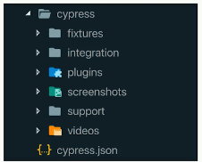

# Consola y estructura de Cypress

La consola de Cypress es la interfaz gráfica de configuración y monitoreo en la que están listados todos los scripts de pruebas que hemos definido. Esta puede visualizarse estando dentro del proyecto con el comando "cypress open"

La primera vez que se ejecuta la consola creará algunos archivos de ejemplo.
Además de la consola, Cypress cuenta con el test runner, una interfaz gráfica adicional en la que se reailzan las simulaciones y pruebas. Tiene dos secciones principales y un menú.

La sección de la izquierda muestra el progreso, los logs y el detalle de todas las pruebas individualmente, mientras que la sección de la derecha muestra el navegador integrado donde se llevan a cabo las pruebas.

## La estructura de carpetas de cypress

fixtures: variables que se usaran en los test
integration: archivos con los test que se van a correr
pluguins
support: archivos con scripts o comandos que se ejecuten despues de cada test

