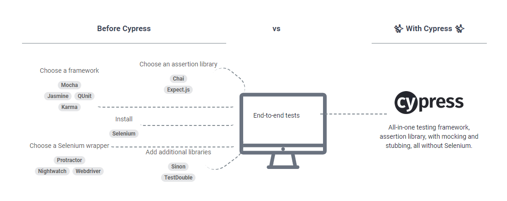

# Cypress Guia

Cypress es un framework para realizar testing End-to-end, cuenta con todas las herramientas necesarias
para que este sea un proceso mucho más facil de llevar.

## Ventajas de usar Cypress

- No usa Selenium
- Se enfoca en hacer e2e muy bien
- Funciona con cualquier frontend
- Test escritos en JavaScript
- Es todo en uno
- Amigable con desarrolladores y QA
- Mucho más rápido que las demás alternativas

# Poyecto de prueba

